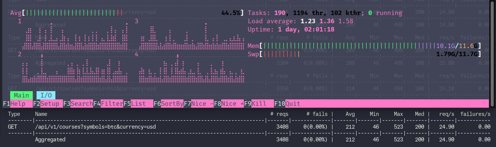

[](https://www.python.org/downloads/release/python-3120/)
[](https://github.com/psf/black)
[](https://github.com/astral-sh/ruff)
# Тестовое задание BWG
>Да, возможно в некоторых моментах оверинжиниринг, но **было весело**

В рамках тестового задания требовалось разработать REST API сервис для мониторинга бирж и получения информации по определённым токенам.

Помимо документации в коде проекта также реализована `SDF`, в которой выложены мысли по причинам того или иного решения в ходе разработки. В коде присутствуют ссылки на эту документацию.

## Немного о результатах
- [x] FastAPI в качестве фреймворка и ассинхронная имплементация сервиса
    - Сделаю небольшое отступление. Использование асинхронной реализации SQLAlchemy привело в тотальной деградации скорости работы сервера. Времени для выяснения причин не было, поэтому от этого пришлось отказаться. По этой же причине не стал прикручивать Ormar
- [x] (Возможно, но я думаю да) Сервис может обработать до 1500 запросов в ед. времени
- [x] Обновление курсов происходит не дольше чем раз в 5 секунд
    - Здесь есть ремарка: запрос на обновление действительно триггерится раз в 5 секунд, однако обновление зависит от биржи, поскольку, например, CoinGecko обновляет свои данные не раньше, чем каждую минуту, в следствие чего была сделана дополнительная оптимизация для таких случаев
- [x] Сервис работает отказаустойчиво (если одна из бирж перестаёт возвращать курсы, то сервис продолжает работать по другой)
- [x] Уровни логирования должны быть разделены на CRITICAL, ERROR, WARNING, INFO, DEBUG
- [x] *Очень длинная строка про биржи и контракт эндпоинта*
- [x] Нагрузочное тестирование реализовать через locust
- [x] Необходимо реализовать версионирование API

Дополнительно:
- [x] Использование postgres с автоматическим накатываением миграций
- [x] Использование одного из популярных инструментов для кэширования
    - Я решил, что прикручивать сюда Redis и библиотеку FastAPI-cache2 - это не совсем то, что нужно, поэтому всё чисто самописное, но суть работы такая же

### О результатах от меня
- Широкая поддержка перевода в валюты. Курсы берутся с помощью сервиса FreeCurrency. [Список здесь](https://freecurrencyapi.com/docs/currency-list)
- БД встаёт автоматически благодаря sql-скриптам, а `alembic` делает свою работу по миграциям + контейнер сервера ждёт полной готовности pg перед запуском во избежание ошибок
- Отдельный поток для получения данных почти не влияет на производительность сервера и позволяет, в случае необходимости, без особых усилий в дальнейшем вынести решение в отдельный сервис

## Тестирование проекта
В проекте есть некоторые юнит и интеграционные тесты, но их покрытие крайне мало и служило мне лишь подспорьем при разработке. Для этого использовался `pytest`.

Нагрузочное тестирование было проведено с помощью `locust`. Сразу сделаю помарку, что тестирование проводилось:
1. На старом ноутбуке
2. В режиме DEBUG vscode`а
3. В уже нагруженной системе

В следствие этого, я не совсем уверен в корректности результатов тестирования, но что-то да протестировалось:


Я не до конца понял условие задачи про *1500 в единицу времени*, поэтому, в целом, 25 RPS примерно равно 1500 RPM.

## Запуск проекта
### Предварительная подготовка
В папке `environments` находятся файлы расширения `*.env.example`. Их нужно преобразовать в обыкновенные `*.env` и заполнить необходимыми значениями.

>Значение `POSTGRES__DBHOST` будет учитываться только при локальном развёртывании. В docker-compose значение будет переназначено на имя postgres-контейнера.

Если необходимо активировать режим отладки для более подробных логов, то необходимо выставить параметр `DEBUG=True`.

На всякий случай, стоит прописать команды, поскольку флаг исполняемости может слететь после клонирования репо:
```bash
chmod +x ./environments/scripts/initdb.sh
chmod +x ./entrypoint.sh
```

### Запуск
```bash
docker-compose up --build -d
```

P.S. В `requirements.txt` ну уж слишком много лишних зависимостей. Не чистил -_-
